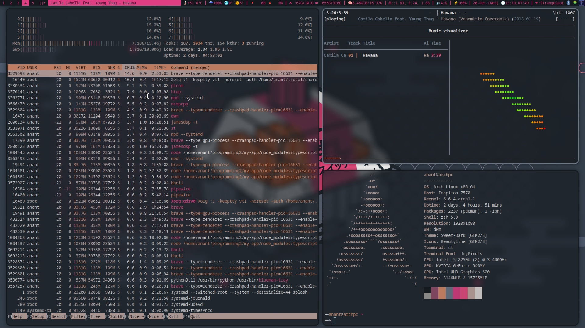
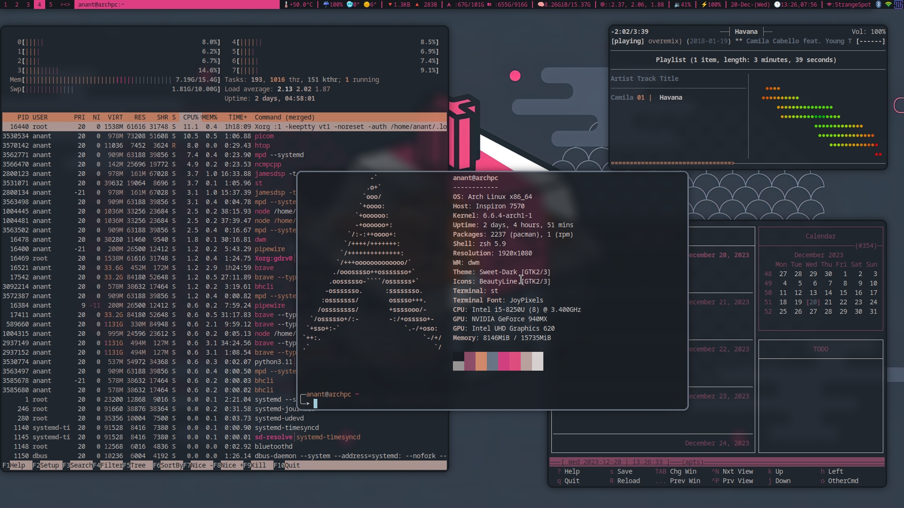
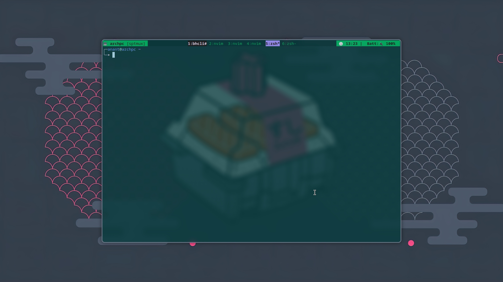

# Strange's build of DWM

## FAQ

> What are the bindings?

This is suckless! The source code is the documentation! Check out [config.h](config.h).<br>
Man page (`man dwm`/`dwm.1`) might not be fully updated.

## Patches and features

- [Clickable statusbar](https://dwm.suckless.org/patches/statuscmd/) with my build of [dwmblocks](https://github.com/lukesmithxyz/dwmblocks).
- Reads [xresources](https://dwm.suckless.org/patches/xresources/) colors/variables (i.e. works with `pywal`, etc.).
- Scratchpad: Accessible with <kbd>mod4+Space</kbd> (st embedded withing tabs) and <kbd>mod1+Space</kbd> (simple st with tmux inside).
- All layouts: Tile, Bstack, Spiral, Dwindle, Deck, Monocle, CenteredMaster, CeneteredFloatingMaster ,Floating.
- True fullscreen (<kbd>super+f</kbd>) and prevents focus shifting.
- Windows can be made sticky (<kbd>super+s</kbd>).
- [hide vacant tags](https://dwm.suckless.org/patches/hide_vacant_tags/) hides tags with no windows.
- [stacker](https://dwm.suckless.org/patches/stacker/): Move windows up the stack manually (<kbd>super-K/J</kbd>).
- [shiftview](https://dwm.suckless.org/patches/nextprev/): Cycle through tags (<kbd>super+g/;</kbd>).
- [vanitygaps](https://dwm.suckless.org/patches/vanitygaps/): Gaps allowed across all layouts.
- [swallow patch](https://dwm.suckless.org/patches/swallow/): if a program run from a terminal would make it inoperable, it temporarily takes its place to save space.
- [dwm-alttab](https://dwm.suckless.org/patches/alt-tab/) : Use <kbd>ALt + Tab</kbd> to switch through windows in same tags 
- [dwm-cool_autostart](https://dwm.suckless.org/patches/cool_autostart/) : Add a cool way to auto start programs within the config.h
- [dwm-systray](https://dwm.suckless.org/patches/systray/) : Adds a systray to end of dwm bar.

## ScreenShots
<details>
<summary>Expand</summary>





</details>


## Installation for newbs

```bash
git clone https://github.com/AnantStrange/dwm.git
cd dwm
sudo make install
```

## Keybindings

#### ScratchPads
<kbd>Mod1 + Space</kbd> : Sptmux - Tmux session withing ST<br> 
<kbd>Mod4 + Space</kbd> : Spterm - ST embeded in Tabbed<br>
<kbd>Ctrl + t</kbd> : Sptorrent - transmission-gtk <br>
<kbd>Mod1 + f</kbd> : Spfile - ranger <br>
<kbd>Mod4 + a</kbd> : Spaudio - pavucontrol<br>

#### Layouts
Tile : <kbd>Mod4 + t</kbd><br>
Bstack : <kbd>Mod4 + Shift+t</kbd><br>
Spiral : <kbd>Mod4 + Shift+s</kbd><br>
Dwindle : <kbd>Mod4 + d</kbd> <br>
Deck : <kbd>Mod4 + Shift+d</kbd><br>
Monocle : <kbd>Mod4 + m</kbd><br>
CenteredMaster : <kbd>Mod4 + c</kbd><br>
CenteredFloatingMaster : <kbd>Mod4 + Shift+c</kbd><br>
Floating : <kbd>Mod4 + Shift+f</kbd><br>

#### General Window Bindings
<kbd>Mod4 + q</kbd> : Kill Window<br>
<kbd>Mod4 + s</kbd> : Make Window Sticky<br>
<kbd>Mod4 + (h,j,k,l)</kbd> : Move around windows<br>

## Dependencies

- [st](https://st.suckless.org/)
- [dmenu](https://tools.suckless.org/dmenu/)
- picom (Compositor)
- [Tabbed](https://tools.suckless.org/tabbed/) (For Spterm Scratchpad)
- Ranger (For Spfile Scratchpad)
- Dunst (For Notifications)
- Pavcontrol (For Spaudio Scrathpad, volume control)
- Transmission-gtk (For Sptorrent Scratchpad)
